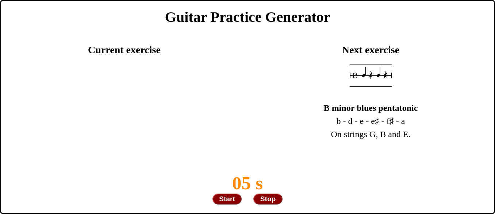
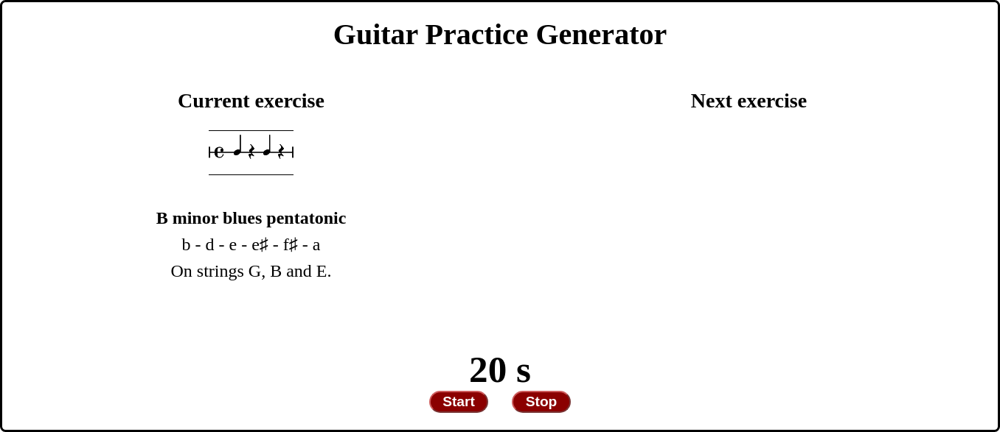
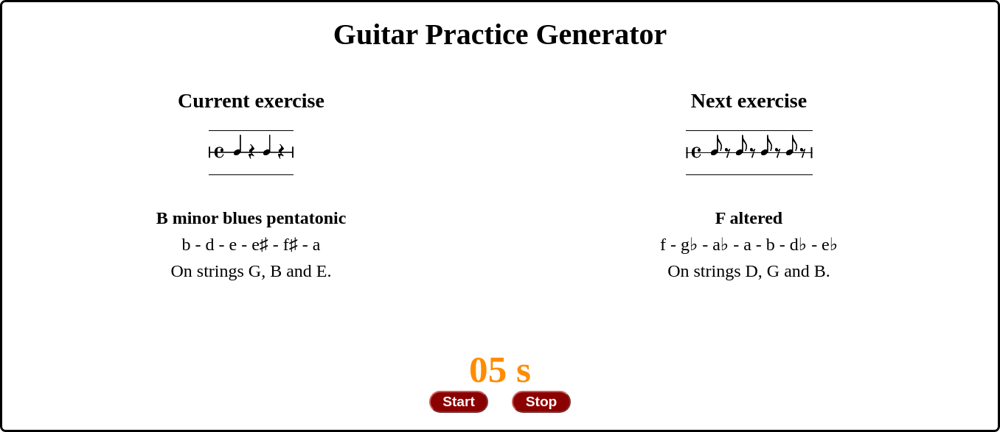

# Guitar Practice Generator | React

The Guitar Practice Generator is an application aiming to help guitarists improve their improvisation skills.

<blockquote>

<strong>Improvisation: the ultimate skill</strong>

</blockquote>

Improvisation is one of the most gratifying activities that a musician can do, but at the same time, is the hardest to master because improvisation is not just one skill but a set of multiple skills.

<h2>The Applicaction</h2>

This is a proof of concept for developing the ludic aspects of a bigger e-learning system. The ludic component should exhibit some characteristics proper of video games, like timers, score, and challenges that depend on the user’s skills levels. Another important aspect of this so-called "ludic component" is to ease self and peer assessment.

This is how the application works: when the user clicks on Start a new exercise is shown on the right side for five seconds. The exercise is a combination of a random rhythmic phrase and a random scale. Then the exercise is moved to the left and the user is expected to improvise for twenty seconds using only the given rhythm and notes. After fifteen seconds in this stage, a new combination of a random rhythmic phrase and a random scale is generated and displayed on the right side, to let the user know what the next exercise will be while they still have five more seconds to perform. At the end of the last five seconds of improvisation, the new exercise is moved to the left and becomes the current exercise. Then the whole cycle repeats over and over.

 
<picture>
	<source srcset="phase_1.png 516w" media="(max-width: 600px)">
	
</picture>
 
<picture>
	<source srcset="phase_2.png 516w" media="(max-width: 600px)">
	
</picture>
 
<picture>
	<source srcset="phase_3.png 516w" media="(max-width: 600px)">
	
</picture>
 

<h2>Pain Points</h2>

When improvising, you have to come up with melodic and rhythmic ideas that you have not played before (hopefully), that work well with the harmony, and you need to play them at the right time.

In essence, improvisation requieres you to:

<ul>
	<li>have good timing and rhythm;</li>
	<li>know instantly where the notes are on the fretboard;</li>
	<li>play along with the harmony below, or even better: say something meaningful with your melody.</li>
</ul>

This can be really challenging at medium and high speeds.

The key, of course, is keep praticing until yo get fluent, but things are not just that straighforward. The <strong>"pratice, practice, practice"</strong> motto can actually be counter-productive if you are not practicing correctly, and when results don't come, boredom, doubt and finally frustration take over.

<h2>Existent solutions</h2>

The common approach to address this particular topic, with or without apps, revolves around practicing with backing tracks using scales as the source of pitches for our melodies, and following some tips for creating interesting licks and phrases.

While this approach may work, very important aspects are missing. Basically, this approach follows the "practice, practice, practice" motto.

<h2>A better approach</h2>

We can use a much better approach. I propose and approach that consists of three pillars:

<blockquote>

<strong>Divide and Conquer</strong>

</blockquote>

As we already stated, improvisation is not just one skill but a set of several skills. If we divide these skills into dimensions, these dimensions can be isolated and simplified, so we can focus on a reduced subset of them at a time. The key here is that we force ourselves to be creative with a few musical devices and techniques at a time.

<blockquote>

<strong> Spot and correct every mistake, instead of "practice, practice, practice"</strong>

</blockquote>

There is a subtle but important difference between the terms "studying" and "training". In a musical context, we can study anything in any way we want (by ear, by reading, by watching others, by doing, with graphics, with apps, with pen and paper, etc), but when it comes to practice, I believe the best approach is to train.

In other words, I would call it <strong>"to practice"</strong> when playing to a backing track in a free way letting your ideas flow, while I would call it <strong>"to train"</strong> when we restrict ourselves to some strings only, some rhythmic patterns and a few musical devices at a time, so we can spot whatever it is that cause us to make mistakes and figure out how to fix it.

<blockquote>

<strong>Motivation and engagement are key for sucess</strong>

</blockquote>

Training is hard and can become really overwhelming, that is why we really need a lot of motivation and a sense of achievement. But there is one thing that always work: having fun. So we need that our training is fun and we need to be able to "count" our successes and fails. We need to make it a game for us.

